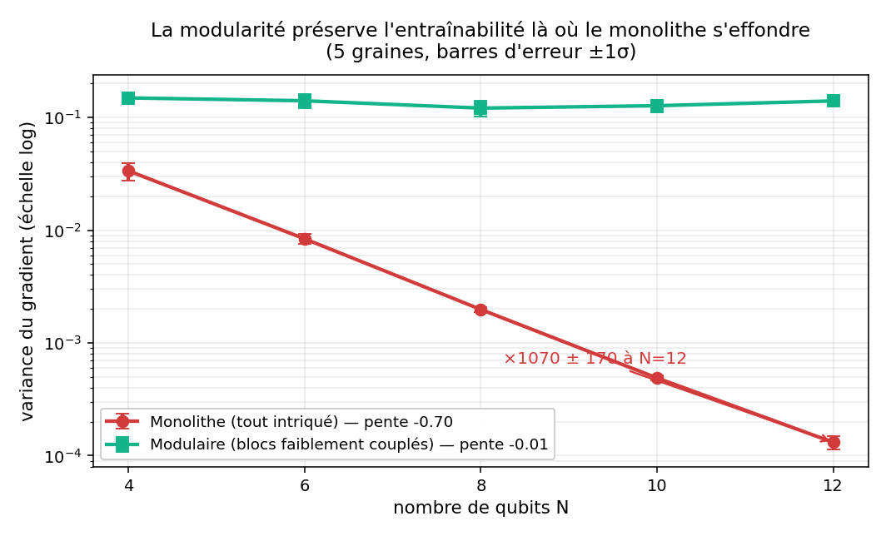
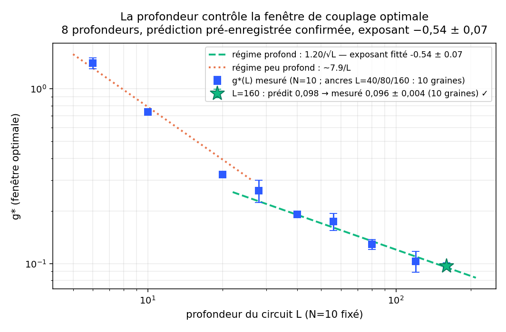

# Weak inter-module coupling and the entanglement/trainability tradeoff in modular quantum circuits

> Independent research project. Reproducible numerical evidence that, in **modular** variational quantum circuits and quantum reservoirs, a **weak continuous inter-module coupling** `g` optimizes the tradeoff between entanglement (a quantum resource) and trainability (gradient variance / barren plateaus).

## One-sentence claim

In a block-structured circuit (strong intra-block entanglement, tunable inter-block ZZ coupling of continuous angle `g`), there is a **weak-coupling window** that keeps roughly half the gradient variance while ~tripling inter-block entanglement — and this window is **set by circuit depth, not size**: `g*(L) ≈ 1.2/√L` in the deep regime (N=10, 8 depths, fitted exponent **−0.54 ± 0.07**, anchors at 10 seeds; **pre-registered prediction at L=160 confirmed**: predicted 0.098, measured 0.096 ± 0.004; **replicated at N=12**, exponent −0.59), consistent with a lightcone-percolation picture where integrated inter-block leakage `L·g²` drives the transition. At fixed depth, `g*` does **not** decrease with system size N. The **relative advantage of the window over the monolith grows with system size** (×1.1 at N=4 → ×2.6 at N=12), suggesting it becomes decisive precisely in the classically-hard regime.

<p align="center">
  
  
</p>

## What is here

| File | What it does |
|---|---|
| `barren_plateau_v2.py` | Monolith vs modular: gradient-variance collapse (slope −0.70 vs −0.01), ratio **×1070 ± 167 at N=12** (5 seeds, see `hardening_suite.py`) |
| `sweet_spot.py` | At fixed N=10: entanglement and trainability vs `g` — the tradeoff curves cross |
| `scaling_fenetre.py` + `scaling_extend.py` | `g*(N)` for N=4–14, 5 seeds; the optimum stays at weak coupling at every size (no drift to the monolith) |
| `depth_test.py` + `depth_test_160.py` | **Main result**: `g*(L)` at fixed N=10, L=6–160 — crossover ~1/L → `1.2/√L`; pre-registered L=160 prediction confirmed |
| `scaling_fenetre_gpu.py` | GPU/CPU port (cupy/numpy) to push N=16–28 on free Kaggle/Colab; Rényi-2 entanglement for speed |
| `performance_sweetspot.py` | **Honest negative result**: full variational training at N=6 shows NO performance optimum at weak coupling — expected, since barren plateaus only bite at N≳10–12 (see limitations) |
| `hardening_suite.py` | **Pre-registered robustness battery**: barren ratio on 5 seeds; intermediate depths L=28/56/120 + seeds 6–10 on anchors; metric-weight sensitivity; von Neumann vs Rényi-2 bias; gradient-position invariance |
| `overnight_suite.py` | **Pre-registered generality battery**: g*(N) at fixed depth (depth-not-size test + cut-parity effect), block-size m=2/3/4, ring vs chain, depth-law replication at N=12, N=16 |
| `make_fig_barren.py`, `make_fig_depth.py`, `make_figs_hardened.py` | Regenerate the figures from the JSON results |
| `results_*.json`, `*_results.json`, `resultats_*.png` | Raw numbers and figures |

## Reproduce

```bash
pip install numpy matplotlib
python scaling_fenetre.py        # ~8 min CPU, produces resultats_scaling_fenetre.png
```

GPU (Kaggle T4, free): set accelerator to GPU, `pip install cupy-cuda12x`, run `scaling_fenetre_gpu.py` (reaches N≈28 in complex128).

## Method (honest scope)

- State-vector simulation, blocks of `m=2` qubits, intra-block ZZ angle `α=π/2` (strong), inter-block ZZ angle `g` (tunable, chain topology), `L=2N` layers of RY+RZ.
- Trainability = variance of the parameter-shift gradient of `⟨Z₀⟩` over random parameters.
- Entanglement = half-cut von Neumann entropy (`scaling_fenetre.py`) or Rényi-2 purity (GPU version, for speed).
- Sweet-spot score = (entanglement fraction) × (gradient-variance fraction); `g*` = parabolic argmax.

## Robustness (overnight pre-registered test battery, June 11–12)

Every test below had its prediction written down **before** the run (see script docstrings):

| Test | Pre-registered | Measured | Verdict |
|---|---|---|---|
| Barren ratio, 5 seeds | ≥ ×500 at N=12 | **×1070 ± 167** | ✅ |
| Deep-regime exponent (5 depths, 10-seed anchors) | ∈ [−0.60, −0.45] | **−0.54 ± 0.07** (bootstrap) | ✅ |
| Replication at N=12 (L=24/48/96) | same law | exponent **−0.59** | ✅ |
| Gradient position (layer 0 / L/2 / L−1) | ≤ ±25% | ≤ 8% | ✅ |
| Depth-not-size: g*(N) at fixed L=20 | no decrease with N | no decrease (N=6→16) | ✅ |
| Live-registered cut-parity test (N=16) | boundary-cut class ≈ 0.39 (naive constant: 0.277) | **0.449 ± 0.087** | ✅ (naive disfavored ~2σ) |
| Metric weight α=0.7 | exponent ∈ [−0.65, −0.40] | −0.65 | ✅ borderline |
| Metric weight α=0.3 | idem | unresolved (g* below grid resolution) | ⚠️ open |
| Rényi-2 vs von Neumann bias | ≤ 15% | +2% to +16% | ✅ quantified |
| Block size m=2/3/4 (15 seeds/point) | naive uniform 1/√m | g*·√m = 0.51/0.52/**0.37** — 1/√m holds within the same cut class (m=2 vs 3, 2% apart); the m=4 drop coincides with a mid-block half-cut, i.e. the **same documented parity artifact** as in g*(N) | naive law refuted; unified diagnostic-artifact picture (post-hoc, mechanism independently tested) |
| Ring vs chain | ring lower ~−10% | **−35%** (cut crosses 2 links → −29% post-hoc) | direction ✅, magnitude under-predicted |

At the deep-regime optimum the window keeps **~50–57% of the gradient variance for ×2.6–3.2 inter-block entanglement** (the earlier "~80%" figure was a shallow-depth value — corrected here).

## Honest limitations (read before citing)

1. The principle "locality mitigates barren plateaus" is **established** (Cerezo et al. 2021). The contribution here is the **continuous coupling sweep**, the **depth law `g*(L)`**, and the unified VQC+reservoir framing — not the qualitative idea.
2. The performance advantage is **structurally beyond classical simulation**: barren plateaus only bite the monolith at `N ≳ 10–12`, so the decisive test needs **real hardware**.
3. The depth law is established at **N=10 and replicated at N=12, one ansatz family** (ZZ chain/ring, m=2–4). The **exponent** is robust (size, gradient position, balanced metric weights); the **constant** is not universal — it shifts with the half-cut parity of the entanglement diagnostic (boundary vs mid-block cut, documented with a live pre-registered test), with block size (~1/√m), and with topology (ring −35%). An earlier apparent `g*(N)` trend conflated size and depth (our protocol used L=2N) and a 2-seed "plateau" claim was **retracted** after a rigorous 5-seed run — documented here deliberately rather than hidden.
4. **Open question (the #1 referee objection):** does the weak-coupling window escape the Cerezo et al. 2025 result "provable absence of barren plateaus ⇒ classical simulability"? This is the central thing to resolve.

## Closest prior work (assumed, cited up front)

- Cerezo et al., *Cost-function-dependent barren plateaus*, 2021 — locality ↔ trainability.
- Patti et al., *Entanglement Devised Barren Plateau Mitigation*, PRR 2021.
- Park et al., *Multi-Chip Ensembles*, arXiv:2505.08782 (2025) — inter-chip coupling, but **binary** (no continuous `g`).
- Askari, Kora, Simon, arXiv:2511.04900 (2025) — memory capacity peaks at weak coupling in spin-network QRC.
- Cerezo et al., *Absence of BP ⇒ classical simulability?*, Nat. Commun. 2025.

## Status

Preliminary but stress-tested: adversarial review, prior-art search over 17 papers, pre-registered predictions — **one confirmed** (L=160: predicted 0.098, measured 0.096 ± 0.004, 10 seeds) — and one earlier claim **retracted** when a rigorous re-run falsified it. **Not a publishable breakthrough as-is** — a precise, coherent hypothesis with reproducible POCs, offered to start a conversation with researchers.

## Author

Nicolas Berger — independent researcher (France). nicobatberger@gmail.com, or open an Issue.
